<div align="center">
  
  <!-- dynamic typing effect 动态打字效果 -->
  <div align="center">
    <a href="https://blog.sunguoqi.com/">
      
    </a>
  </div>

  <!-- knock code pictures 敲代码的图片 -->
  <br>

  <!-- Snake Code Contribution Map 贪吃蛇代码贡献图 -->
<picture>
  <source media="(prefers-color-scheme: dark)" srcset="https://cdn.jsdelivr.net/gh/mbfczzz/mbfczzz/profile-snake-contrib/github-contribution-grid-snake-dark.svg" />
  <source media="(prefers-color-scheme: light)" srcset="https://cdn.jsdelivr.net/gh/mbfczzz/mbfczzz/profile-snake-contrib/github-contribution-grid-snake.svg" />
  
</picture>

</div>

<!-- wakatime 统计 -->
### 📊 WakaTime

<picture>
  <source
    srcset="https://github-readme-stats.vercel.app/api/wakatime?username=mbfczzz&layout=compact&text_color=f0f6fc&bg_color=00000000&hide_border=true&hide_title=true"
    media="(prefers-color-scheme: dark)"
  />
  <source
    srcset="https://github-readme-stats.vercel.app/api/wakatime?username=mbfczzz&layout=compact&text_color=1f2328&bg_color=00000000&hide_border=true&hide_title=true"
    media="(prefers-color-scheme: light), (prefers-color-scheme: no-preference)"
  />
  
</picture>

</td></tr>

<tr><td>

<!--START_SECTION:waka-->
**I'm a Night 🦉** 

```text
🌞 Morning                274 commits         █████░░░░░░░░░░░░░░░░░░░░   19.38 % 
🌆 Daytime                425 commits         ████████░░░░░░░░░░░░░░░░░   30.06 % 
🌃 Evening                507 commits         █████████░░░░░░░░░░░░░░░░   35.86 % 
🌙 Night                  208 commits         ████░░░░░░░░░░░░░░░░░░░░░   14.71 % 
```
📅 **I'm Most Productive on Friday** 

```text
Monday                   207 commits         ████░░░░░░░░░░░░░░░░░░░░░   14.64 % 
Tuesday                  187 commits         ███░░░░░░░░░░░░░░░░░░░░░░   13.22 % 
Wednesday                188 commits         ███░░░░░░░░░░░░░░░░░░░░░░   13.30 % 
Thursday                 155 commits         ███░░░░░░░░░░░░░░░░░░░░░░   10.96 % 
Friday                   353 commits         ██████░░░░░░░░░░░░░░░░░░░   24.96 % 
Saturday                 147 commits         ███░░░░░░░░░░░░░░░░░░░░░░   10.40 % 
Sunday                   177 commits         ███░░░░░░░░░░░░░░░░░░░░░░   12.52 % 
```


📊 **This Week I Spent My Time On** 

```text
🕑︎ Time Zone: Asia/Shanghai

💬 Programming Languages: 
Vue.js                   8 hrs 18 mins       █████████░░░░░░░░░░░░░░░░   34.03 % 
TypeScript               6 hrs 34 mins       ███████░░░░░░░░░░░░░░░░░░   26.95 % 
Markdown                 5 hrs 39 mins       ██████░░░░░░░░░░░░░░░░░░░   23.20 % 
HTML                     1 hr 27 mins        █░░░░░░░░░░░░░░░░░░░░░░░░   05.97 % 
JavaScript               57 mins             █░░░░░░░░░░░░░░░░░░░░░░░░   03.90 % 

🔥 Editors: 
VS Code                  24 hrs 24 mins      █████████████████████████   100.00 % 

💻 Operating System: 
Windows                  20 hrs 57 mins      █████████████████████░░░░   85.92 % 
Mac                      3 hrs 26 mins       ████░░░░░░░░░░░░░░░░░░░░░   14.08 % 
```


 Last Updated on 28/07/2023 01:19:50 UTC
<!--END_SECTION:waka-->
  
</td></tr>
</table>

<!-- ########################################## 分割 ########################################## -->


<div align="center" >



<!-- just img 图片 -->


<!--  skill badge 技能徽章 -->

```mermaid
mindmap
  root((小孙同学))
    编程
      Web开发
      网络爬虫
      人工智能
    摄影
      人文
      建筑
      风景
    旅行
      苏州
      南京
      滁州
      合肥
      寿县
    阅读
      人物传记
      个人成长
      社会文化
      心理
      计算机技术
```

💪 正在学习


  
🧠 计划学习


🧰 常用的工具


<!-- programming tool icon 编程工具图标 -->
<br>

<!-- svg -->


 


<br>

<!-- gif -->


<!-- just img 图片 -->
</div>

<!-- profile-3d-contrib 3D贡献图-->

</div>

<!-- ########################################## 分割 ########################################## -->


<div align="center" >

<!-- Github-Stats-Terminal 终端风格信息 -->
<br>
  
<!-- Quotes 名人名言 -->
<br>
  
<!-- GitHub 奖杯🏆 -->
<br>

<!-- GitHub 数据统计 -->

<br><br>

<!-- Awesome repo 比较好的仓库-->
<a href="https://github.com/mbfczzz/Awesome-Love-Code">
</a>
<a href="https://github.com/mbfczzz/Student-Data-Vision">
</a><br><br>
  
<!-- Wakatime Graph-->
<table>
  <tr>
    <td></td>
    <td></td>
  </tr>
  <tr>
    <td colspan="2"><a href="https://run.sunguoqi.com"></a><br></td>
  </tr>
</table>
</div>

<!-- ########################################## 分割 ########################################## -->


<div align="center">

<!-- run 图片 -->


<!-- Joke 笑话 -->
<div></div>

<!-- github-readme-streak-stats 连续提交代码天数记录 -->
&emsp;

&emsp;

<!-- metrics 基础资料 -->
&emsp;

&emsp;

<!-- GitHub Activity Graph GitHub 活动图 -->
<table align="center">
  <tr>
    <td></td>
  </tr>
</table>

</div>

<!-- ########################################## 分割 ########################################## -->


<!-- GitHub metrics 信息指标 -->
<div align="center">

<!-- just img 图片 -->


<!-- first form 第一个表格 -->
<table>
  <tr>
    <td></td>
  </tr>
</table>

<!-- second form 第二个表格 -->
<table>
  <tr>
    <td></td>
    <td></td>
  </tr>
  <tr>
    <td></td>
    <td></td>
  </tr>
  <tr>
    <td></td>
    <td></td>
  </tr>
  <tr>
    <td></td>
    <td></td>
  </tr>
  <tr>
    <td></td>
    <td></td>
  </tr>
  <tr>
    <td></td>
    <td></td>
  </tr>
</table>


<!-- just img 图片 -->

</div>
